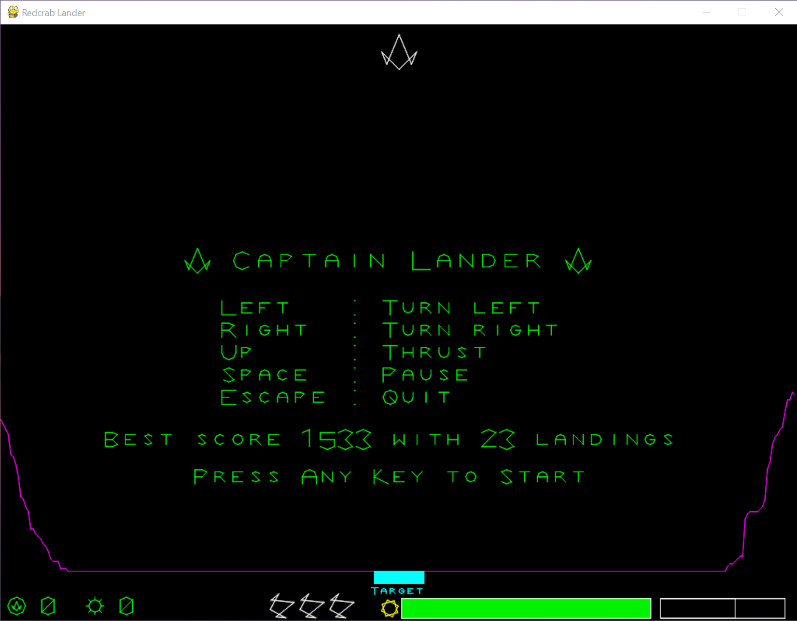

  
# Captain Lander  
  
A Python 3 project with pygame  
  
  
  
This project is a portage of the Freebasic game freely available at http://games.freebasic.net/startdownload.php?file=L/lander.zip&gameID=59  
and explained in Freebasic forum at https://www.freebasic.net/forum/viewtopic.php?f=8&t=8405   
  
It has already be ported in Unity see http://home.roki.zone/unity and a variant http://home.roki.zone/DAPI    
  
you may run directly captainlander.py by executing  
  
**>python captainlander.py** 
## Synopsis
You are Captain Lander and you must protect the Federation from an alien enemy that steals all energy.
Using your agility in this classic lander inspired game, you have to pilot a ship with precision in order to complete the mission.

This game do use only "line drawing" for everything (  text, landscape and object), with a particularity that every object (letter or "sprite") are defined by polar coordinates ( distance and angle) instead of cartesian coordinates  (x and y).

## Commands
### Keyboard

 - **Escape** : Quit the game
 - **Left arrow**  : rotate lander counter clockwise
 - **Right arrow** : rotate lander clockwise
 - **Up arrow** : Thrust
 - **Space** : pause / resume game

### Joystick

 - Analog stick left/right : rotate left and right
 - Hat stick left/right : rotate left and right
 - Any button : thrust

### Touch screen

 - **Top half screen** : pause / resume game
 - Bottom half screen :
	 - **Left area** : rotate lander counter clockwise
	 - **Right area** : rotate lander clockwise
	 - **Middle area** : thrust

## Music 
Andrea Baroni "Of Gods and Philosophers", see asset/readme.txt file  
  
## SFX  
Zero Rare, retro sound effects
